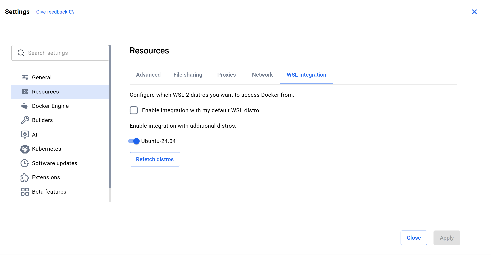
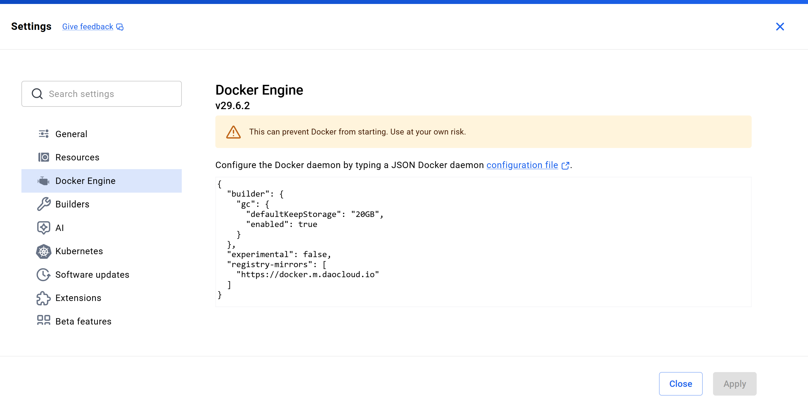

# 做linux检查
```
user=jiang
dir=/mnt/c/Users/jiang/Documents/practice/docs/labs
id:
uid=1000(jiang) gid=1000(jiang) groups=1000(jiang),4(adm),24(cdrom),27(sudo),30(dip),46(plugdev),100(users),1001(docker)
kernel
Linux jiang 6.18.33.2-microsoft-standard-WSL2 #1 SMP PREEMPT_DYNAMIC Thu Jun 18 21:54:43 UTC 2026 x86_64 x86_64 x86_64 GNU/Linux
disk:
Filesystem      Size  Used Avail Use% Mounted on
/dev/sdd       1007G  1.7G  954G   1% /
rootfs          6.8G  2.8M  6.8G   1% /init
none            6.8G     0  6.8G   0% /dev/shm
none            6.8G  548K  6.8G   1% /run
none            6.8G     0  6.8G   0% /run/lock
none            6.8G   60K  6.8G   1% /run/user
drivers         501G  300G  201G  60% /usr/lib/wsl/drivers
none            6.8G     0  6.8G   0% /usr/lib/wsl/lib
none            6.8G   23M  6.8G   1% /mnt/wsl
none            6.8G  104K  6.8G   1% /mnt/wslg/versions.txt
none            6.8G  104K  6.8G   1% /mnt/wslg/doc
none            6.8G     0  6.8G   0% /usr/lib/modules/6.18.33.2-microsoft-standard-WSL2
C:\             501G  300G  201G  60% /mnt/c
D:\             452G  112G  340G  25% /mnt/d
tmpfs           1.4G   20K  1.4G   1% /run/user/1000
memory:
               total        used        free      shared  buff/cache   available
Mem:            13Gi       1.0Gi        12Gi        26Mi       582Mi        12Gi
Swap:          4.0Gi          0B       4.0Gi
addresses:
1: lo: <LOOPBACK,UP,LOWER_UP> mtu 65536 qdisc noqueue state UNKNOWN group default qlen 1000
    link/loopback 00:00:00:00:00:00 brd 00:00:00:00:00:00
    inet 127.0.0.1/8 scope host lo
       valid_lft forever preferred_lft forever
    inet 10.255.255.254/32 brd 10.255.255.254 scope global lo
       valid_lft forever preferred_lft forever
    inet6 ::1/128 scope host 
       valid_lft forever preferred_lft forever
2: eth0: <BROADCAST,MULTICAST,UP,LOWER_UP> mtu 1472 qdisc mq state UP group default qlen 1000
    link/ether 00:15:5d:e6:d0:18 brd ff:ff:ff:ff:ff:ff
    inet 172.20.176.49/20 brd 172.20.191.255 scope global eth0
       valid_lft forever preferred_lft forever
    inet6 fe80::215:5dff:fee6:d018/64 scope link 
       valid_lft forever preferred_lft forever
port:State  Recv-Q Send-Q  Local Address:Port Peer Address:PortProcess                                   
LISTEN 0      1000   10.255.255.254:53        0.0.0.0:*                                             
LISTEN 0      4096       127.0.0.54:53        0.0.0.0:*    users:(("systemd-resolve",pid=106,fd=17))
LISTEN 0      4096    127.0.0.53%lo:53        0.0.0.0:*    users:(("systemd-resolve",pid=106,fd=15))
```

# Day01 Docker 与 MySQL 单机实验

## 1.实验目标
理解docker 的基本使用，包括镜像、容器、数据卷、网络等；
掌握MySQL的基本使用，包括MySQL从0到1的配置，包括环境变量、指定目录挂载、端口映射等，并验证容器删除但已存放在指定目录下的数据仍存在
## 2.实验环境
WSL（内核）-> Ubuntu-24.04-> docker-desktop


检查docker-desktop 与 wsl2是否连接，获取docker版本
未连接：
```python
jiang@jiang:~$ docker --version

The command 'docker' could not be found in this WSL 2 distro.
We recommend to activate the WSL integration in Docker Desktop settings.
For details about using Docker Desktop with WSL 2, visit:
https://docs.docker.com/go/wsl2/
```
WSL2中的Ubuntu-24.04 没有权限，没有正确连接docker-desktop
>打开docker-desktop -> “Setting” -> 左侧Resources -> “WSL Integration(WSL系统集成)” -> 勾选所使用的发行版（这里使用的是Ubuntu-24.04）-> 点击“Apply & restart” -> powershell 中执行docker --version（问题没有解决可在终端输入 'wsl --shutdown' 手动重启）


```python
PS C:\Windows\system32> wsl --shutdown    #单独重启：wsl -t [发行版]
PS C:\Windows\system32> wsl -l -v
  NAME              STATE           VERSION
* Ubuntu-24.04      Running         2        '*'表默认发行版
  docker-desktop    Running         2

jiang@jiang:~$ docker --version
Docker version 29.6.2, build dfc4efb
```

拉取镜像的前置条件：
```python
jiang@jiang:~$ docker pull nginx:alpine
Error response from daemon: failed to resolve reference "docker.io/library/nginx:alpine": failed to authorize: failed to fetch oauth token: Post "https://auth.docker.io/token": EOF
```
由于docker-desktop的守护进程(daemon)无法通过docker-Hub的认证服务，无法获取合法的令牌服务，导致拉取镜像失败:
```
docker pull
   ->docker CLI(客户端)
      ->docker desktop 守护进程
         ->代理/网络
            ->dns域名解析
               ->docker hub认证服务
                  ->镜像仓库
                     ->下载镜像层
```
1.解决办法：
   通过`docker info`命令可以确定docker desktop守护进程是否可以使用（①是否正确执行并输出 Server 模块；②是否输出 Server 版本号；③系统资源是否正常识别），如果不正常，则需要检查docker desktop 的设置，确保网络设置正确，并重启docker desktop也可以通过`docker --version` / `docker ps`。
   检查版本号、守护进程配置的HTTP代理地址和HTTPS的代理地址、不使用代理的地址列表，有输出但不排除不能访问docker hub。
      ```
      jiang@jiang:~$ docker info --format 'Server={{.ServerVersion}} HTTPProxy={{.HTTPProxy}} HTTPSProxy={{.HTTPSProxy}} NoProxy={{.NoProxy}}'
      Server=29.6.2 HTTPProxy=http.docker.internal:3128 HTTPSProxy=http.docker.internal:3128 NoProxy=hubproxy.docker.internal
      ```
   直接访问docker hub认证服务测试连接，超时说明错误发生在docker hub认证服务请求，排除镜像损坏或命令写错。
      ```
      jiang@jiang:~$ curl -sS -o /dev/null -w 'HTTP=%{http_code} TIME=%{time_total}s\n' --max-time 15 https://auth.docker.io/token
      curl: (28) Connection timed out after 15001 milliseconds HTTP=000 TIME=15.001659s
      ```
   >-s 不输出任何内容  
    -S 在状态码大于400时，显示错误信息
    -o /dev/null 丢弃响应体，只关心状态码和耗时，不下载内容
    -w 打印自定义内核
    --max-time 设置最大连接时间
   
   在此之前，用`docker info`检测的代理环境变量属于docker守护进程（干活的人），但还需要检查终端（shell）的代理。
   
   curl https://auth.docker.io/token 获取令牌，因此需要正确代理变量；
   docker 守护进程需要正确的代理配置才能拿着令牌进入镜像仓库拉去镜像。
      ```
      jiang@jiang:~$ env | grep -i proxy || echo "没有代理环境变量"
      没有代理环境变量
      ```
      
    DNS可以解析，但只获取到ipv6地址；很多网络环境的ipv6地址通过NAT转换无法直接访问网络，即无法直接使用，于是连接会超时，强制使用ipv4地址进行连接：
      ```
      jiang@jiang:~$ getent hosts auth.docker.io
      2a03:2880:f134:183:face:b00c:0:25de auth.docker.io

      curl -4 -sS -o /dev/null -w 'HTTP=%{http_code} TIME=%{time_total}s\n' --max-time 15 https://auth.docker.io/token
      jiang@jiang:~$ getent hosts auth.docker.io
      2a03:2880:f134:183:face:b00c:0:25de auth.docker.io
      jiang@jiang:~$ curl -4 -sS -o /dev/null -w 'HTTP=%{http_code} TIME=%{time_total}s\n' --max-time 15 https://auth.docker.io/token
      curl: (28) Connection timed out after 15007 milliseconds
      ```
    结论：ipv4地址也超时，说明不是单纯的ipv6的问题，可能是wsl无法直连docker hub 造成的。

    测试与百度的连通性，确定代理配置，如果百度也超时则考虑配置可用代理，百度连接成功则只有docker hub超时，则为docker hub配置代理/镜像源。
      ```
      curl -4 -I --max-time 10 https://www.baidu.com
      HTTP/1.1 200 OK
      Cache-Control: private, no-cache, no-store, proxy-revalidate, no-transform
      Content-Length: 0
      Content-Type: text/html
      Pragma: no-cache
      Server: bfe
      Date: Thu, 13 Aug 2026 08:54:33 GMT
      ```
    测试准备好的镜像站是否能访问，当看到HTTP/1.1 401 Unauthorized(镜像仓库的正常未认证响应但可访问该网站)或200时，确定镜像站可用。
      ```
      jiang@jiang:~$ curl -4 -I --max-time 10 https://docker.m.daocloud.io/v2/
      HTTP/2 401
      server: nginx
      date: Thu, 13 Aug 2026 08:56:43 GMT
      content-type: application/json; charset=utf-8
      content-length: 73
      www-authenticate: Bearer realm="https://m.daocloud.io/auth/token",service="docker.m.daocloud.io"
      docker-distribution-api-version: registry/2.0
      ```
在docker hub设置中，修改docker engine内容，添加后点击“Apply &Restart”并在docker-shell中运行`wsl --shutdown`重启docker hub。
```
"registry-mirrors": [
    "https://docker.m.daocloud.io"
  ]
```


```python
jiang@jiang:~$ docker info
Client:
 Version:    29.6.2
 Context:    default
 Debug Mode: false
 Plugins:
  agent: Docker AI Agent Runner (Docker Inc.)
    Version:  v1.115.0
    Path:     /usr/local/lib/docker/cli-plugins/docker-agent
  ai: Docker AI Agent - Ask Gordon (Docker Inc.)
    Version:  v1.27.0
    Path:     /usr/local/lib/docker/cli-plugins/docker-ai
  buildx: Docker Buildx (Docker Inc.)
    Version:  v0.35.0-desktop.2
    Path:     /usr/local/lib/docker/cli-plugins/docker-buildx
  compose: Docker Compose (Docker Inc.)
    Version:  v5.3.1
    Path:     /usr/local/lib/docker/cli-plugins/docker-compose
  debug: Get a shell into any image or container (Docker Inc.)
    Version:  0.0.47
    Path:     /usr/local/lib/docker/cli-plugins/docker-debug
  desktop: Docker Desktop commands (Docker Inc.)
    Version:  v0.4.3
    Path:     /usr/local/lib/docker/cli-plugins/docker-desktop
  dhi: CLI for managing Docker Hardened Images (Docker Inc.)
    Version:  v0.0.7
    Path:     /usr/local/lib/docker/cli-plugins/docker-dhi
  extension: Manages Docker extensions (Docker Inc.)
    Version:  v0.2.31
    Path:     /usr/local/lib/docker/cli-plugins/docker-extension
  init: Creates Docker-related starter files for your project (Docker Inc.)
    Version:  v1.4.0
    Path:     /usr/local/lib/docker/cli-plugins/docker-init
  mcp: Docker MCP Plugin (Docker Inc.)
    Version:  v0.43.3
    Path:     /usr/local/lib/docker/cli-plugins/docker-mcp
  model: Docker Model Runner (Docker Inc.)
    Version:  v1.2.6
    Path:     /usr/local/lib/docker/cli-plugins/docker-model
  offload: Docker Offload (Docker Inc.)
    Version:  v0.6.9
    Path:     /usr/local/lib/docker/cli-plugins/docker-offload
  pass: Docker Pass Secrets Manager Plugin (beta) (Docker Inc.)
    Version:  v0.2.0
    Path:     /usr/local/lib/docker/cli-plugins/docker-pass
  sandbox: "docker sandbox" is deprecated, use Docker Sandboxes instead (Docker Inc.)
    Version:  v0.13.0
    Path:     /usr/local/lib/docker/cli-plugins/docker-sandbox
  scout: Docker Scout (Docker Inc.)
    Version:  v1.23.1
    Path:     /usr/local/lib/docker/cli-plugins/docker-scout

Server:
 Containers: 2
  Running: 1
  Paused: 0
  Stopped: 1
 Images: 3
 Server Version: 29.6.2
 Storage Driver: overlayfs
  driver-type: io.containerd.snapshotter.v1
 Logging Driver: json-file
 Cgroup Driver: cgroupfs
 Cgroup Version: 2
 Plugins:
  Volume: local
  Network: bridge host ipvlan macvlan null overlay
  Log: awslogs fluentd gcplogs gelf journald json-file local splunk syslog
 CDI spec directories:
  /etc/cdi
  /var/run/cdi
 Discovered Devices:
  cdi: docker.com/gpu=webgpu
 Swarm: inactive
 Runtimes: nvidia runc io.containerd.runc.v2
 Default Runtime: runc
 Init Binary: docker-init
 containerd version: e53c7c1516c3b2bff98eb76f1f4117477e6f4e66
 runc version: v1.3.6-0-g491b69ba
 init version: de40ad0
 Security Options:
  seccomp
   Profile: builtin
  cgroupns
 Kernel Version: 6.18.33.2-microsoft-standard-WSL2
 Operating System: Docker Desktop
 OSType: linux
 Architecture: x86_64
 CPUs: 16
 Total Memory: 13.55GiB
 Name: docker-desktop
 ID: 7ca8a1b3-1412-4fb9-8b47-54609fcd5beb
 Docker Root Dir: /var/lib/docker
 Debug Mode: false
 HTTP Proxy: http.docker.internal:3128
 HTTPS Proxy: http.docker.internal:3128
 No Proxy: hubproxy.docker.internal
 Labels:
  com.docker.desktop.address=unix:///var/run/docker-cli.sock
 Experimental: false
 Insecure Registries:
  hubproxy.docker.internal:5555
  127.0.0.0/8
  ::1/128
 Registry Mirrors:
  https://docker.m.daocloud.io/
 Live Restore Enabled: false
 Firewall Backend: iptables
```
## 3.nginx容器实验
```python
确认docker 可用:
jiang@jiang:~$ docker compose version
Docker Compose version v5.3.1
jiang@jiang:~$ docker version
Client:
 Version:           29.6.2
 API version:       1.55
 Go version:        go1.26.5
 Git commit:        dfc4efb
 Built:             Thu Jul 16 16:11:35 2026
 OS/Arch:           linux/amd64
 Context:           default

Server: Docker Desktop 4.85.0 (235549)
 Engine:
  Version:          29.6.2
  API version:      1.55 (minimum version 1.40)
  Go version:       go1.26.5
  Git commit:       3d80467
  Built:            Thu Jul 16 16:12:20 2026
  OS/Arch:          linux/amd64
  Experimental:     false
 containerd:
  Version:          v2.2.5
  GitCommit:        e53c7c1516c3b2bff98eb76f1f4117477e6f4e66
 runc:
  Version:          1.3.6
  GitCommit:        v1.3.6-0-g491b69ba
 docker-init:
  Version:          0.19.0
  GitCommit:        de40ad0

下载镜像：
jiang@jiang:~$ docker pull nginx:alpine

alpine: Pulling from library/nginx
46519e7231d2: Pull complete
d0008c891db4: Pull complete
46f977ee452f: Pull complete
55afa1ecc21d: Pull complete
3cd534fe98c6: Pull complete
1223f016b4e4: Pull complete
62bec68d7c31: Pull complete
390dc935348d: Pull complete
139c372786b9: Download complete
cd757d6c129e: Download complete
Digest: sha256:4a73073bd557c65b759505da037898b61f1be6cbcc3c2c3aeac22d2a470c1752
Status: Downloaded newer image for nginx:alpine
docker.io/library/nginx:alpine

jiang@jiang:~$ docker images
                                                                                                    i Info →   U  In Use
IMAGE                ID             DISK USAGE   CONTENT SIZE   EXTRA
hello-world:latest   7f4da0fc94bc       25.9kB         9.49kB
nginx:alpine         4a73073bd557       93.6MB           27MB    U

启动容器:
docker run --name day1-nginx -d -p 8080:80 nginx:alpine   -d:后台运行

检查容器：
jiang@jiang:~$ docker ps -a
CONTAINER ID   IMAGE          COMMAND                  CREATED        STATUS                        PORTS                               NAMES
680c50ac1ba5   nginx:alpine   "/docker-entrypoint.…"   41 hours ago   Exited (0) 40 hours ago                                           day1-nginx

jiang@jiang:~$ docker port day1-nginx
8080->80

jiang@jiang:~$ docker logs --tail 20 day1-nginx
2026/08/11 16:48:16 [notice] 1#1: signal 29 (SIGIO) received
2026/08/11 16:48:16 [notice] 1#1: signal 17 (SIGCHLD) received from 23
2026/08/11 16:48:16 [notice] 1#1: worker process 23 exited with code 0
2026/08/11 16:48:16 [notice] 1#1: signal 29 (SIGIO) received
2026/08/11 16:48:16 [notice] 1#1: signal 17 (SIGCHLD) received from 30
2026/08/11 16:48:16 [notice] 1#1: worker process 22 exited with code 0
2026/08/11 16:48:16 [notice] 1#1: worker process 27 exited with code 0
2026/08/11 16:48:16 [notice] 1#1: worker process 30 exited with code 0
2026/08/11 16:48:16 [notice] 1#1: worker process 32 exited with code 0
2026/08/11 16:48:16 [notice] 1#1: worker process 34 exited with code 0
2026/08/11 16:48:16 [notice] 1#1: worker process 28 exited with code 0
2026/08/11 16:48:16 [notice] 1#1: worker process 36 exited with code 0
2026/08/11 16:48:16 [notice] 1#1: worker process 25 exited with code 0
2026/08/11 16:48:16 [notice] 1#1: worker process 31 exited with code 0
2026/08/11 16:48:16 [notice] 1#1: worker process 37 exited with code 0
2026/08/11 16:48:16 [notice] 1#1: signal 29 (SIGIO) received
2026/08/11 16:48:16 [notice] 1#1: signal 17 (SIGCHLD) received from 36
2026/08/11 16:48:16 [notice] 1#1: signal 17 (SIGCHLD) received from 35
2026/08/11 16:48:16 [notice] 1#1: worker process 35 exited with code 0
2026/08/11 16:48:16 [notice] 1#1: exit

jiang@jiang:~$ curl -I http://localhost:8080
HTTP/1.1 200 OK
```
通过构建一个完整的nginx容器理解并熟练使用docker基本参数的使用，并理解容器这一轻量级应用与宿主机的关系和端口映射。
## 4.故障实验
```
停止容器：
jiang@jiang:~$ docker stop day1-nginx
day1-nginx

jiang@jiang:~$ docker ps -a
CONTAINER ID   IMAGE          COMMAND                  CREATED        STATUS                        PORTS                               NAMES
680c50ac1ba5   nginx:alpine   "/docker-entrypoint.…"   41 hours ago   Exited (0) 41 hours ago                                           day1-nginx

此时无法访问该容器端口：
jiang@jiang:~$ curl -I http://localhost:8080
curl: (7) Failed to connect to localhost port 8080 after 0 ms: Couldn't connect to server

重新运行该容器：
jiang@jiang:~$ docker restart day1-nginx
day1-nginx
jiang@jiang:~$ docker ps -a
CONTAINER ID   IMAGE          COMMAND                  CREATED        STATUS                        PORTS                                     NAMES
7059bf15a55b   mysql:8.4      "docker-entrypoint.s…"   39 hours ago   Exited (255) 30 minutes ago   33060/tcp, 0.0.0.0:3307->3306/tcp         day1-mysql
680c50ac1ba5   nginx:alpine   "/docker-entrypoint.…"   41 hours ago   Up 8 seconds                  0.0.0.0:8080->80/tcp, [::]:8080->80/tcp   day1-nginx
jiang@jiang:~$ curl -I http://localhost:8080
HTTP/1.1 200 OK
Server: nginx/1.31.3
Date: Thu, 13 Aug 2026 09:29:45 GMT
Content-Type: text/html
Content-Length: 896
Last-Modified: Wed, 15 Jul 2026 16:53:52 GMT
Connection: keep-alive
ETag: "6a57bb20-380"
Accept-Ranges: bytes
```
### 故障分析
停止容器运行后，发现无法访问8080

### 排查
检查`docker ps -a`发现容器状态Exited

### 恢复
执行`docker restart day1-nginx`重新启动容器，查看`docker ps -a`确定day1-nginx状态up，再次测试与其连通性，可以看到准确的端口映射。

### 结论
端口映射本身不能保证服务可用，容器内部进程正常运行才可以提供服务。

## 5.MySQL数据卷实验
```python
先安全输入临时密码，如果在当前shell中exit则会失效，在新终端中需要重新输入以下命令:
read -s -p "Enter temporary MySQL password:" MYSQL_ROOT_PASSWORD
echo
export MYSQL_ROOT_PASSWORD
# -s 表示静默输入，提高密码安全性
# -p 表示打印双引号中的提示信息
# echo 避免命令提示符接在密码之后，影响美观
# export 将变量导出为环境变量才能被shell子进程（比如docker run）识别使用

启动数据卷：
docker volume create day1-mysql-data

启动MySQL容器，如果没有拉取镜像会先自动下载相应镜像：
docker run --name day1-mysql `
-e MYSQL_ROOT_PASSWORD="$MYSQL_ROOT_PASSWORD" `
-e MYSQL_DATABASE=lab `
-p 3307:3306 `
-v day1-mysql-data:/var/lib/mysql `
-d mysql:8.4

查看日志，看到'ready for connections'则说明day1-MySQL创建并成功运行成功：
jiang@jiang:~$ docker logs -f day1-mysql
2026-08-11 18:11:37+00:00 [Note] [Entrypoint]: Entrypoint script for MySQL Server 8.4.11-1.el9 started.
2026-08-11 18:11:38+00:00 [Note] [Entrypoint]: Switching to dedicated user 'mysql'
2026-08-11 18:11:38+00:00 [Note] [Entrypoint]: Entrypoint script for MySQL Server 8.4.11-1.el9 started.
'/var/lib/mysql/mysql.sock' -> '/var/run/mysqld/mysqld.sock'
2026-08-11T18:11:38.444641Z 0 [System] [MY-015015] [Server] MySQL Server - start.
2026-08-11T18:11:38.837815Z 0 [System] [MY-010116] [Server] /usr/sbin/mysqld (mysqld 8.4.11) starting as process 1
2026-08-11T18:11:38.848780Z 1 [System] [MY-013576] [InnoDB] InnoDB initialization has started.
2026-08-11T18:11:39.291909Z 1 [System] [MY-013577] [InnoDB] InnoDB initialization has ended.
2026-08-11T18:11:39.612932Z 0 [Warning] [MY-010068] [Server] CA certificate ca.pem is self signed.
2026-08-11T18:11:39.612992Z 0 [System] [MY-013602] [Server] Channel mysql_main configured to support TLS. Encrypted connections are now supported for this channel.
2026-08-11T18:11:39.617327Z 0 [Warning] [MY-011810] [Server] Insecure configuration for --pid-file: Location '/var/run/mysqld' in the path is accessible to all OS users. Consider choosing a different directory.
2026-08-11T18:11:39.658969Z 0 [System] [MY-011323] [Server] X Plugin ready for connections. Bind-address: '::' port: 33060, socket: /var/run/mysqld/mysqlx.sock
2026-08-11T18:11:39.659336Z 0 [System] [MY-010931] [Server] /usr/sbin/mysqld: ready for connections. Version: '8.4.11'  socket: '/var/run/mysqld/mysqld.sock'  port: 3306  MySQL Community Server - GPL.

查看数据库：
 docker exec -it day1-mysql mysql -uroot -p"$MYSQL_ROOT_PASSWORD" -e "SELECT VERSION(); SHOW DATABASES;"
 mysql: [Warning] Using a password on the command line interface can be insecure.
+-----------+
| VERSION() |
+-----------+
| 8.4.11    |
+-----------+
+--------------------+
| Database           |
+--------------------+
| information_schema |
| lab                |
| mysql              |
| performance_schema |
| sys                |
+--------------------+

创建测试表：
docker exec -it day1-mysql mysql -uroot -p"$MYSQL_ROOT_PASSWORD" lab -e "CREATE TABLE users(id INT PRIMARY KEY AUTO_INCREMENT, name VARCHAR(50)); INSERT INTO users(name) VALUES ('jiang'); SELECT * FROM users;"
mysql: [Warning] Using a password on the command line interface can be insecure.
+----+-------+
| id | name  |
+----+-------+
|  1 | jiang |
+----+-------+

删除密码环境变量：
unset MYSQL_ROOT_PASSWORD
```
熟练掌握MySQL的基本使用，通过端口映射，设置环境变量，挂载指定目录等实现MySQL数据库的数据存储。

# MySQL数据库故障模拟实验：
```
停止并删除容器：
docker stop day1-mysql
docker rm day1-mysql

重新创建新的MySQL容器：
read -s -p "Enter temporary MySQL password: " MYSQL_ROOT_PASSWORD
echo
export MYSQL_ROOT_PASSWORD
docker run --name day1-mysql-new `
-e MYSQL_ROOT_PASSWORD="$MYSQL_ROOT_PASSWORD" `
-p 3307:3306 `
-v day1-mysql-data:/var/lib/mysql `
-d mysql:8.4
docker exec -it day1-mysql-new mysql -uroot -p"$MYSQL_ROOT_PASSWORD" lab -e "SELECT * FROM users;"
mysql: [Warning] Using a password on the command line interface can be insecure.
+----+-------+
| id | name  |
+----+-------+
|  1 | jiang |
+----+-------+

```
### 故障分析
当删除旧容器后，新建新容器挂载在旧容器的宿主机目录上，再不新建数据表的情况下可以发现旧容器的数据仍然存在，说明数据卷的使用是持久的。容器删除≠数据删除。